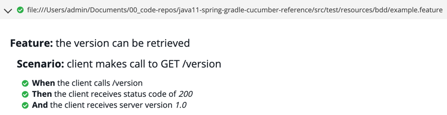

# java11-spring-gradle-cucumber-reference

Cucumber framework for Java reference.


<details>
<summary>About</summary>

Made with:
- **IntelliJ IDEA 2023.1 (Ultimate Edition)**
- **OpenJDK 11.0.17**
- **Gradle 8.1.1**

</details>


---


### Build jar

<details>
<summary>Expand</summary>

```shell
./gradlew clean build -DPROFILE=local
```

</details>


---


### Run Cucumber tests

<details>
<summary>Expand</summary>

```shell
./scripts/test.sh \
  local \
  lofty-root-378503 \
  test_dataset_integration \
  test_table_integration \
  $HOME/.config/gcloud \
  "$(gcloud auth application-default print-access-token)"
```


</details>


---


### View BDD test results

After running the tests, find the `cucumber-report.html` file under the `target` directory.
Open the file with a web browser:


