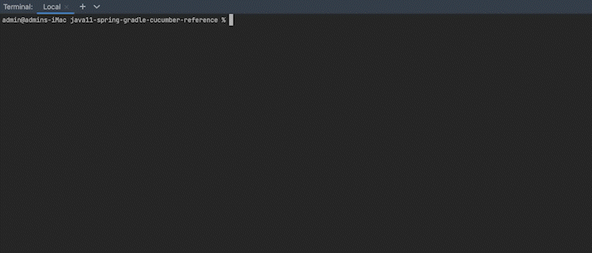

# java11-spring-gradle-cucumber-reference

Cucumber framework for Java reference.


Made with:
- **IntelliJ IDEA 2023.1 (Ultimate Edition)**
- **openjdk 11.0.17**
- **Gradle 7.6.1**


---


### Build jar

<details>
<summary>Expand</summary>

```shell
./gradlew clean build
```

</details>


---


### Run Cucumber tests

<details>
<summary>Expand</summary>

```shell
./gradlew cukes
```



</details>


---


### View BDD test results

After running the tests, find the `cucumber-report.html` file under the `target` directory.
Open the file with a web browser:


